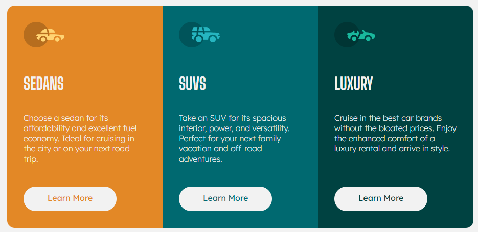
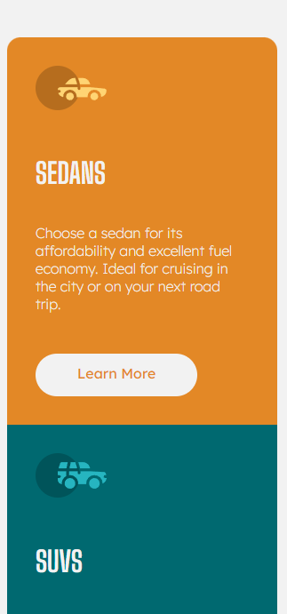

# Frontend Mentor - 3-column preview card component solution

This is a solution to the [3-column preview card component challenge on Frontend Mentor](https://www.frontendmentor.io/challenges/3column-preview-card-component-pH92eAR2-). Frontend Mentor challenges help you improve your coding skills by building realistic projects. 

## Table of contents

- [Overview](#overview)
  - [The challenge](#the-challenge)
  - [Screenshot](#screenshot)
  - [Links](#links)
- [My process](#my-process)
  - [Built with](#built-with)
  - [What I learned](#what-i-learned)


**Note: Delete this note and update the table of contents based on what sections you keep.**

## Overview

### The challenge

Users should be able to:

- View the optimal layout depending on their device's screen size
- See hover states for interactive elements

### Screenshots




### Links

- Solution URL: [here](https://your-solution-url.com)
- Live Site URL: [here](https://github.com/BMcdavitt/remThreeColPreviewCard/tree/master)

## My process

### Built with

- Semantic HTML5 markup
- CSS custom properties
- Flexbox
- CSS Grid
- Mobile-first workflow
- [React](https://reactjs.org/) - JS library

### What I learned

Mainly this was a refresher in using @media queries, as well as figuring out how to put the rounded corners in the correct place depending on the display size.


```css
.Card:nth-child(-n + 1) {
  border-top-left-radius: 15px;
  border-top-right-radius: 15px;
}

@media screen and (min-width: 750px) {
  .Card:nth-child(-n + 1) {
    border-top-left-radius: 15px;
    border-top-right-radius: 0px;
    border-bottom-left-radius: 15px;
  }
}

.Card:nth-last-child(-n + 1) {
  border-bottom-left-radius: 15px;
  border-bottom-right-radius: 15px;
}

@media screen and (min-width: 750px) {
  .Card:nth-last-child(-n + 1) {
    border-top-right-radius: 15px;
    border-bottom-left-radius: 0px;
    border-bottom-right-radius: 15px;
  }
}

```


